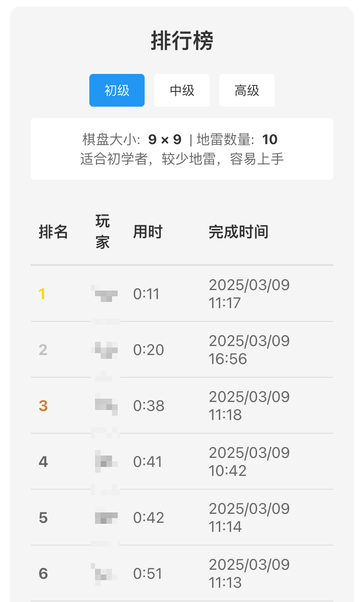

# Minesweeper Game

一个基于 React + FastAPI 的扫雷游戏实现。

## 功能特点

- 三种难度级别（初级、中级、高级）
- 实时游戏状态显示（剩余地雷数、计时器）
- 左键点击揭示格子，右键点击标记地雷
- 自动展开空白区域
- 游戏胜负判定

## 游戏截图




## 技术栈

### 后端
- Python 3.8+
- FastAPI
- Pydantic
- Uvicorn

### 前端
- React 18
- TypeScript
- Styled Components
- Axios

## 开发环境设置

1. 进入开发环境：
```bash
nix develop
```

2. 安装依赖：
```bash
# 安装后端依赖
# nix develop 已安装依赖

# 安装前端依赖
cd webapp
yarn install
```

## 运行项目

1. 启动后端服务：
```bash
cd src
python main.py
```
后端服务将在 http://localhost:8000 运行

2. 启动前端开发服务器：
```bash
cd webapp
yarn dev
```
前端应用将在 http://localhost:3000 运行

## API 文档

启动后端服务后，可以通过以下地址访问 API 文档：
- Swagger UI: http://localhost:8000/docs
- ReDoc: http://localhost:8000/redoc

## 游戏规则

1. 左键点击格子来揭示内容
2. 右键点击格子来标记/取消标记地雷
3. 数字表示周围八个格子中的地雷数量
4. 揭示所有非地雷格子即为胜利
5. 点击到地雷则游戏结束

## 项目结构

```
├── src/                    # 后端代码
│   ├── main.py            # FastAPI 应用入口
│   ├── models.py          # 数据模型定义
│   ├── game_logic.py      # 游戏核心逻辑
│   └── requirements.txt   # Python 依赖
│
└── webapp/                 # 前端代码
    ├── src/
    │   ├── components/    # React 组件
    │   ├── services/      # API 服务
    │   ├── types.ts       # TypeScript 类型定义
    │   └── App.tsx        # 主应用组件
    ├── package.json       # 项目配置
    └── tsconfig.json      # TypeScript 配置
```

## 前端配置文件说明

### package.json
项目的核心配置文件，包含以下重要信息：
- 项目基本信息：名称为"minesweeper-frontend"，版本为0.1.0
- 依赖项管理：
  - 核心依赖：React、React DOM、TypeScript、Axios等
  - 开发依赖：Vite等构建工具
- 脚本命令：
  - `yarn dev`: 使用 Vite 启动开发服务器
  - `yarn build`: 使用 TypeScript 编译并用 Vite 构建生产版本
  - `yarn preview`: 预览构建后的生产版本
  - `yarn start`: 使用 react-scripts 启动应用

### tsconfig.json
TypeScript 的主配置文件，定义了编译器行为：
- 编译目标：使用最新的 ECMAScript 特性（ESNext）
- JSX 支持：配置为 React JSX
- 严格的类型检查：启用严格模式和各种类型检查选项
- 模块解析：使用 Node.js 风格的模块解析
- 源码位置：指定源代码在 `src` 目录下
- 其他特性：
  - 允许导入 JSON 文件
  - 启用严格的类型检查
  - 禁止未使用的变量和参数

### vite.config.ts
Vite 构建工具的配置文件：
- 配置 React 插件支持
- 指定项目根目录
- 构建输出配置：
  - 输出目录：`dist`
  - 资源目录：`assets`
  - 构建前清空输出目录
- 路径别名配置：将 `@` 映射到 `src` 目录
- 资源文件的命名规则和目录结构

### tsconfig.node.json
专门为 Vite 配置文件准备的 TypeScript 配置：
- 启用项目引用功能
- 配置模块解析为 ESNext 和 bundler
- 允许默认导入的语法
- 仅包含 vite.config.ts 文件

## 构建工具说明

本项目使用 Vite 作为构建工具，它具有以下优势：

1. **开发服务器**
- 极快的服务器启动速度
- 基于原生 ES 模块的开发服务
- 按需编译，提高开发效率

2. **构建优化**
- 使用 Rollup 进行生产环境构建
- 自动代码分割
- Tree-shaking（移除未使用的代码）
- 自动处理 CSS、图片等资源

3. **开发体验**
- 快速的热模块替换（HMR）
- TypeScript 和 JSX 的开箱即用支持
- CSS 预处理器支持
- 静态资源处理

4. **使用方式**
- 开发模式：`yarn dev`
- 构建生产版本：`yarn build`
- 预览生产版本：`yarn preview`

